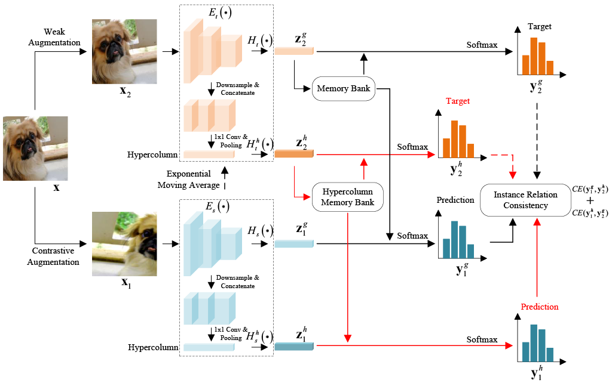

# CGH: Self-Supervised Representation Learning with Cross-Context Learning between Global and Hypercolumn Features

<p align="center">
    <a href="https://arxiv.org/abs/2308.13392"></a>
</p>
<p align="center">
	Self-Supervised Representation Learning with Cross-Context Learning between Global and Hypercolumn Features (WACV 2024)<br>
  By
  <a href="">Zheng Gao</a>, 
  <a href="">Chen Feng</a>, and 
  <a href="">Ioannis Patras</a>.
</p>

## Introduction

> **Abstract**: Whilst contrastive learning yields powerful representations by matching different augmented views of the same instance, 
it lacks the ability to capture the similarities between different instances. One popular way to address this limitation 
is by learning global features (after the global pooling) to capture inter-instance relationships based on knowledge 
distillation, where the global features of the teacher are used to guide the learning of the global features of the 
student. Inspired by cross-modality learning, we extend this existing framework that only learns from global features 
by encouraging the global features and intermediate layer features to learn from each other. This leads to our novel 
self-supervised framework: cross-context learning between global and hypercolumn features (CGH), that enforces the 
consistency of instance relations between low- and high-level semantics. Specifically, we stack the intermediate 
feature maps to construct a **hypercolumn** representation so that we can measure instance relations using 
two contexts (hypercolumn and global feature) separately, and then use the relations of one context to guide the 
learning of the other. This cross-context learning allows the model to learn from the differences between the two 
contexts. The experimental results on linear classification and downstream tasks show that our method outperforms the 
state-of-the-art methods.




## Installation
Please refer to `requirement.txt` for the dependencies. Alternatively, you can install dependencies using the following command:
```
pip3 install -r requirement.txt
```
The repository works with `PyTorch 1.10.2` or higher and `CUDA 11.1`.

## Get Started

We provide basic usage of the implementation in the following sections:

### Pre-training on ImageNet

Download [ImageNet](https://image-net.org/challenges/LSVRC/2012/) dataset and specify the path to ImageNet folder in the config file `configs/cgh/imagenetcfg.py`.

To perform pre-training of the model with ResNet-50 backbone on ImageNet with multi-gpu, run:
```
python3 launch.py --device=${DEVICES} --launch pretrain.py \
      --phase="pretrain" \
      --dataset=imagenet \
      --arch=resnet50 \
      --model=cgh \
      --exp_dir=./exp_dir \
      --multiprocessing_distributed
```
`DEVICES` denotes the gpu indices.

### Evaluation: Linear Classification on ImageNet
With a pre-trained model, to train a supervised linear classifier on frozen features/weights with multi-gpu, run:
```
python3 launch.py --device=${DEVICES} --launch eval_lincls.py \
      --phase="lincls" \
      --dataset=imagenet \
      --arch=resnet50 \
      --model=cgh \
      --exp_dir=./exp_dir \
      --pretrained=${PRETRAINED_PATH} \
      --multiprocessing_distributed
```
`PRETRAINED_PATH` denotes the path to the pre-trained checkpoint.

### Evaluation: KNN Evaluation on ImageNet
To reproduce the KNN evaluation results with a pre-trained model, run:
```
python3 launch.py --device=${DEVICES} --launch eval_knn.py \
    --phase="knn" \
    --arch=resnet50 \
    --checkpoint_key="net" \
    --encoder_key="encoder_q" \
    --exp_dir=./exp_dir \
    --pretrained=${PRETRAINED_PATH} \
    --data=${IMAGENET_ROOT} \
    --multiprocessing_distributed
```
`IMAGENET_ROOT` is the path to ImageNet folder.

### Evaluation: Transfer Learning - Object Detection on VOC / COCO

#### 1. Download [VOC](http://places.csail.mit.edu/user/index.php) and [COCO](https://cocodataset.org/#download) Dataset.

#### 2. Install [detectron2](https://github.com/facebookresearch/detectron2/blob/main/INSTALL.md).

#### 3. Convert a pre-trained model to the format of detectron2:
```
cd detection
python3 convert-pretrain-to-detectron2.py [your pretrained weight] out.pkl
```

#### 4. Specify the path to the dataset:
```
export DETECTRON2_DATASETS=[your dataset folder]
```

#### 5. Train on PASCAL VOC/COCO:

##### Finetune and evaluate on VOC (with 8 GPUs):
```
cd detection
python3 train_net.py --config-file ./configs/pascal_voc_R_50_C4_24k_moco.yaml \
--num-gpus 8 MODEL.WEIGHTS out.pkl
```

##### Finetune and evaluate on COCO (with 8 GPUs):
```
cd detection
python3 train_net.py --config-file ./configs/coco_R_50_C4_1x_moco.yaml \
--num-gpus 8 MODEL.WEIGHTS out.pkl
```


## Citation

If you find this repository useful, please consider giving a star :star: and citation:

```bibteX
@article{gao2023self,
  title={Self-Supervised Representation Learning with Cross-Context Learning between Global and Hypercolumn Features},
  author={Gao, Zheng and Feng, Chen and Patras, Ioannis},
  journal={arXiv preprint arXiv:2308.13392},
  year={2023}
}
```

## License

This project is released under the [Apache 2.0 license](LICENSE).